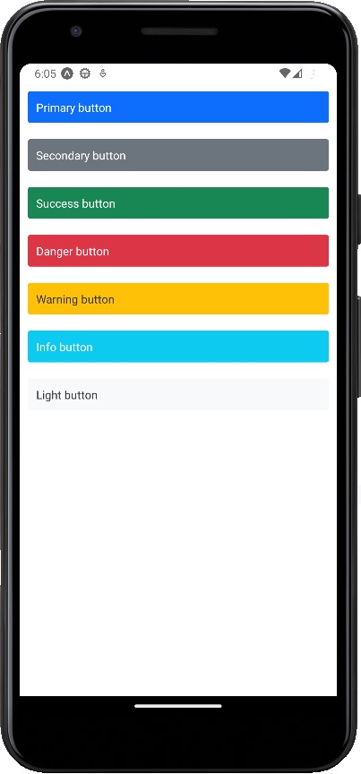

# Exercise 2

A simple app to create a reusable button with mutliple themes support.

## How to use ?

- Run `npm install`.
- Open you andorid or iOS simulator.
- Run `npm start`.
- The metro bundler will open in the browser, choose run on android or iOS.

## Screenshot

