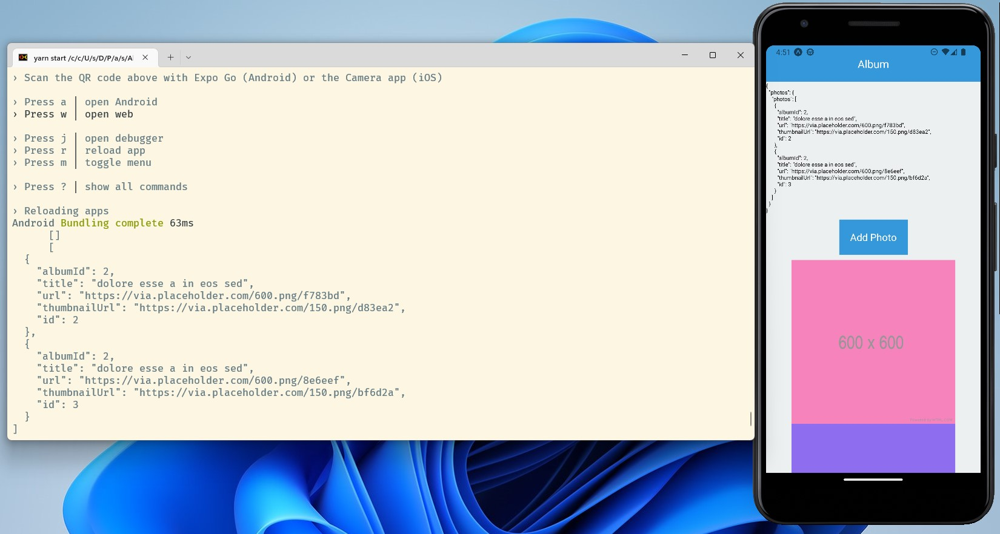

# Exercise 6

A simple app to create an image album app using redux.

## How to use ?

- Run `npm install`.
- Open you andorid or iOS simulator.
- Run `npm start`.
- The metro bundler will open in the browser, choose run on android or iOS.

## Screenshots

